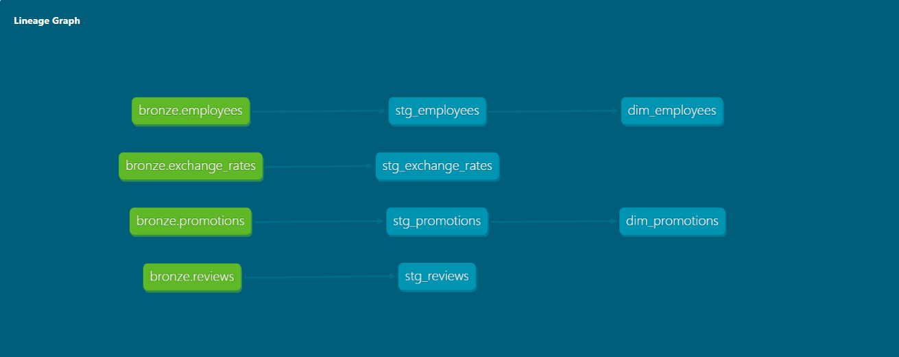
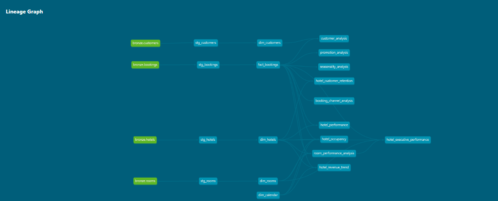
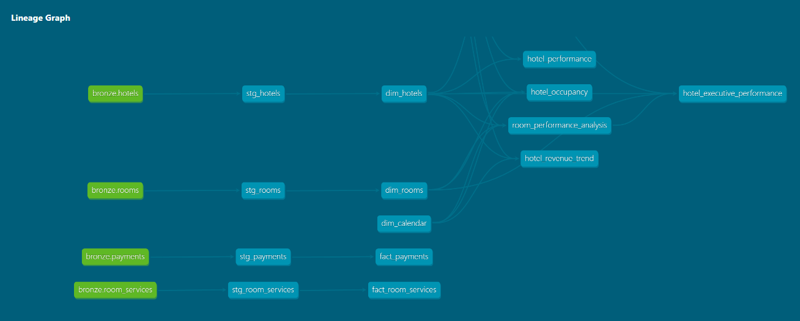

# dbt Documentation & Lineage

This project uses dbt to transform the Snowflake Gold layer
into business-ready analytical models.

## Analytics Models

The analytics layer contains 10 business-focused models:

1. Hotel Performance
2. Hotel Revenue Trend
3. Hotel Occupancy
4. Customer Value Analysis
5. Booking Channel Analysis
6. Promotion Performance
7. Hotel Customer Retention
8. Room Performance
9. Seasonality Analysis
10. Hotel Executive Performance

## Data Quality

All analytical models are covered by dbt schema tests.

Current test result:

- dbt tests: PASS
- Test failures: 0

## Lineage

The following diagram shows the dependencies between the
Snowflake models and the dbt analytical layer.

## Documentation

The dbt models are documented through `schema.yml`, including:

- Model descriptions
- Column descriptions
- Data quality tests
- Model dependencies
- Business definitions